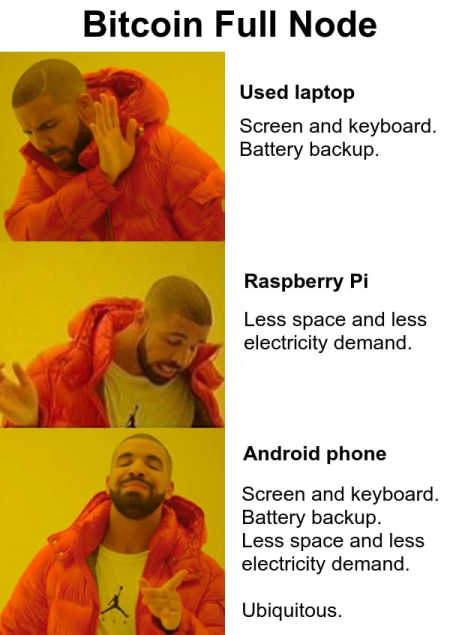

# smartino

Bash scripts for installing Bitcoin Core on Android and run a full node on a phone!  



That's possible because:
* you can run Ubuntu (or other distro) in your Android phone thanks to [Andronix](https://andronix.app)
* you can attach an external drive to the phone using a USB hub or insert an high capacity MicroSD card

## Why a full node on a phone
You can run a full node on a laptop and have the comfort of having screen and keyboard, not to mention to have a battery backup in case of a power cut.\
You can run a full node on a Raspberry Pi or other single-boar computer and have advantages such as less space required and less electricity demand.\
With a phone you run a full node and you can get all the pros of both laptop and Raspberry Pi. In addition a phone offers ubiquity and portability!  

## Based on...
Installation is based on the process described in [this tutorial](https://bitbrasil.com.br/node-android-external-drive.html) (found [here](https://portaldobitcoin.uol.com.br/brazilian-teaches-how-to-run-a-full-bitcoin-node-on-an-android-smartphone-tutorial)), which in turn is a modified version of [BitNodes.io script](https://bitnodes.io/install-full-node.sh).

Here are some enhancements:
* Added a more reliable probing strategy for detecting external storage
* *Added the ability of connecting external drive having already blockchain data (".bitcoin" folder)
* Harden the externalization of Bitcoin Core data directory
* Updated Bitcoin Core version
* Added a couple of shortcut commands
* Fixed some typos in comments and messages
* Some other small improvements

**It may be not recognized by Android. Please be aware Android supports exFAT/NTFS/EXT4/F2FS partitions up to version 8.1 (Oreo)*

## Requirements
* Android phone with OTG support or high capacity MicroSD support
* **Root privileges**
* 1 TB external storage (no more than one connected to the phone)
* USB hub to connect both phone charger and external drive to the phone

<p style="background-color: lightyellow;">WARNING: The use of low-quality chargers/USB cables, or with specifications that differ from those indicated by the manufacturer, may damage the phone's battery.<br />
Ensure that the phone indicates that the battery is charging when the charger is connected via the USB hub; otherwise, it is advisable to change the hub. If the battery icon does not show charging status, the recharging process may still occur, but there is a risk of damaging the battery to the point of causing it to swell!</p>

## Root privileges
If you are not able or do not want to root your phone you can use the original guide that works - according to what the author says - only with some Samsung models having [DeX](https://en.wikipedia.org/wiki/Samsung_DeX) support.
Actually root is not required only in case Termux app mounts your removable/external drive under `/storage` path. In that case you have write access to drive but with a limit: the only writable location on the external drive is `Android/data/com.termux/files`, a private Termux directory.
If this trade-off is ok for you then you can go for original guide and waive the enhancements described [above](#based-on).

## Installation
* Connect the external drive to the phone and be sure you can open it with a file explorer
* Install the latest version of [Termux](https://f-droid.org/en/packages/com.termux)
* Run the following command (it will basically install Ubuntu on your phone), answer "y" to all questions and allow Termux to have access to the storage:
```
pkg upgrade && termux-setup-storage && curl https://raw.githubusercontent.com/AndronixApp/AndronixOrigin/master/repo-fix.sh > repo.sh && chmod +x repo.sh && bash repo.sh && pkg update -y && pkg install wget proot tar tsu mount-utils -y && wget https://raw.githubusercontent.com/smartm0use/smartino/main/install-ubuntu20.sh -O install-ubuntu20.sh && chmod +x install-ubuntu20.sh && bash install-ubuntu20.sh
```
* Be sure you got no errors in mounting external drive, then run the following command from Ubuntu shell (it will install Bitcoin Core and it will set the `datadir` to the external drive):
```
apt update && apt upgrade -y && apt install curl -y && curl https://raw.githubusercontent.com/smartm0use/smartino/main/install-full-node.sh | sh
```
* For incoming connections to your node be sure you've configured your router for [port forwarding](https://bitcoin.org/en/full-node#port-forwarding) (port 8333) and optionally to change your [firewall settings](https://bitcoin.org/en/full-node#firewall-configuration)
* Once your node is fully synced with the blockchain visit [Bitnodes](https://bitnodes.io/#join-the-network) to check connection

# EXTRAS - Give more power to your node!

## Remote access using SSH
If you find awkward tapping on a small screen, you may consider to get remote access to your phone following [SSH Basics](https://docs.andronix.app/ssh/ssh-basics) by Andronix or these steps:
* `apt update`
* `apt install openssh-server nano`
* `nano /etc/ssh/sshd_config` and make the following changes:
    * Find and change the line `#Port 22` to `Port 2222`
    * Find the line `#PermitRootLogin prohibit-password` or `#PermitRootLogin yes` and change it to `PermitRootLogin yes`
    * Save and exit pressing CTRL+X and then type Y and press Enter to confirm
* `ssh-keygen -A` and then `ssh-keygen`
* Set user password with `passwd` (minimal length is 1 character)
* `/usr/sbin/sshd` to start the SSH server (if you get *Missing privilege seperation directory: /run/sshd* just create that directory with `mkdir /run/sshd` and run the command again)
* `hostname -I` or `ip a` or `ifconfig` to know your local IP address
* Now you are able to connect to the phone from another device with the following command: `ssh root@<PHONE_IP_ADDRESS> -p 2222`

## Running node under Tor
Since you are using a mobile device you may use a SIM or an eSIM with a mobile data plan. In this case port forwarding to enable incoming connections to your node could not work due mobile operator limitations. Using Tor is the solution.
* If it is running stop Bitcoin Core (`stop-btc` command)
* If you didn't do it for a while run `apt update`
* Install tor running `apt install tor`
* Figure out where your torrc file is (`/etc/tor/torrc` is one possibility) and uncomment/add the following lines:
```
ControlPort 9051
CookieAuthentication 1
CookieAuthFileGroupReadable 1
```
* For further settings (i.e. anonymity) and more information about using Bitcoin Core with Tor you can follow the guide [Setting up a Tor hidden service](https://en.bitcoin.it/wiki/Setting_up_a_Tor_hidden_service) on Bitcoin Wiki
* Launch Tor with `/etc/init.d/tor start` (you can check if it is running with `/etc/init.d/tor status`)
* Start Bitcoin Core (with `start-btc` command) and then run `debug-btc` to take note of the Onion address that is advertised. You can check for reachability on [BitNodes.io](https://bitnodes.io)
